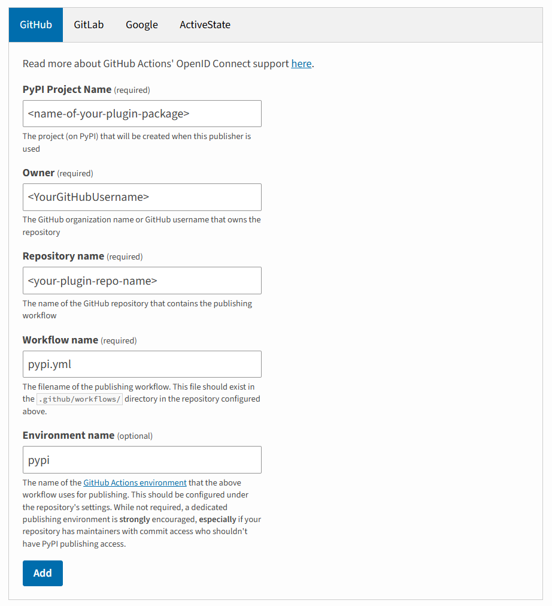

.. _pluginDevGuide:

Creating Plugins for |PsychoPy|
===============================

Plugins provide a means for developers to extend |PsychoPy|, adding new features
and customizations without directly modifying the |PsychoPy| installation.

The plugin system works by searching for "`:ref:_entryPoints`". If your package defines an entry point targeting |PsychoPy|, it will be found and imported when ``psychopy.plugins.activatePlugins`` is called - which the PsychoPy app calls on starting, as do any Builder experiments. Any changes made to |PsychoPy| with plugins do not persist
across sessions, meaning if Python is restarted, |PsychoPy| will return to its
default behaviour unless ``activatePlugins()`` is called again.

Read :ref:`usingplugins` for more information about plugins before proceeding on this page.

Creating your plugin package
-------------------------------

A plugin is ultimately just a type of Python package, just one which interacts with |PsychoPy|, so you can create one in the same way you would make any other Python package. Check out the `Python Packaging User Guide <https://packaging.python.org/en/latest/guides/writing-pyproject-toml/>`_ for a comprehensive guide to making Python packages in general. Below we'll go through the key steps of making a |PsychoPy| plugin package specifically.

Naming your plugin package
~~~~~~~~~~~~~~~~~~~~~~~~~~~~~~~

To help users find your plugin and to make it clear that it is a |PsychoPy| plugin, your plugin package name should start with ``psychopy-`` followed by a word or a few words which describe what it is (separated by ``-``). The module within your plugin package (the folder that gets imported when a user does ``import <your plugin>``) should have the same name as the package but with ``-`` replaced by ``_``. Below are some example plugin names and what they do:

.. list-table:: Title
   :header-rows: 1

   * - Package name
     - Module name
     - Description
   * - psychopy-visionscience
     - psychopy_visionscience
     - Adds various stimuli which are useful for vision scientists
   * - psychopy-face-api
     - psychopy-face-api
     - Add support for Face API in PsychoJS experiments created using Builder
   * - psychopy-cedrus
     - psychopy_cedrus
     - Adds support for Cedrus devices (button boxes, photodiodes, voicekeys, etc.)
   * - psychopy-monkeys
     - psychopy_monkeys
     - Adds various "response monkey" Components, which save time testing by immitating participant responses when running in pilot mode

Structuring your plugin package
~~~~~~~~~~~~~~~~~~~~~~~~~~~~~~~

A plugin package is no different structurally from any other package, so see the official `Packaging Python Projects guide <https://packaging.python.org/tutorials/packaging-projects>`_ for details on how to structure a Python package in general. For |PsychoPy| plugins specifically, we strongly recommend starting by cloning the `template plugin repo <https://github.com/psychopy/psychopy-plugin-template>`_ and modifying it rather than starting from scratch.

.. _pyprojectTOML:
pyproject.toml
~~~~~~~~~~~~~~~~~~~

Python looks for a file at the root level of your plugin package called ``pyproject.toml``, which contains the information it needs (name, version, etc.) to set up the package. Essentially, it's what turns a Python module into a Python package. For an example of a finished ``pyproject.toml`` file, check out the one from the `template plugin repo <https://github.com/psychopy/psychopy-plugin-template>`_.

.. _entryPoints:
Entry points
~~~~~~~~~~~~~~~~~~~

Defining an entry point is essentially telling Python "pretend that ``x.y`` is also located at ``z.y``", similar to if the file ``z.py`` had ``from x import y`` at the top. This allows an external package to edit what can be imported from |PsychoPy| without changing any of |PsychoPy|'s code. |PsychoPy| can also get a list of all plugin packages which define entry points to a certain place, which in some cases will help it find your plugin. For example, if you wanted to add a Component, you would define an entry point to ``psychopy.experiment.components`` and Builder would then find your plugin Component by looking for that entry point.

.. _baseClasses:
Base classes
~~~~~~~~~~~~~~~~~~~

In many cases, the element your plugin package adds may need to be a subclass of a particular base class to be detected and used properly. For example, a new Component should be a subclass of ``psychopy.experiment.components.BaseComponent``. Similarly, new backend for a hardware Component which supports multiple backends (such as :ref:_buttonboxcomponent or :ref:_voicekeycomponent) would need to be a subclass of ``psychopy.experiment.components.plugins.DeviceBackend``. 

If you're unsure what to subclass, try looking for another similar element in |PsychoPy| or in another plugin and see what they subclass (for example, ``psychopy.experiment.components.buttonBox.KeyboardButtonBoxBackend`` is a subclass of ``DeviceBackend``).

Testing your plugin package
-------------------------------

Once you're ready to try your plugin package out, you can install it via the Plugins & Packages Manager in Builder (opened via the Tools menu item or the "Get more..." button at the top of the Components panel). In the "Packages" tab, click the "Install from file" button and select the ``pyproject.toml`` file for your plugin (you will need to change the file type dropdown to look for "Python projects" rather than a "Wheel files" to see it). Doing so will prompt PsychoPy to perform an `editable install <https://pip.pypa.io/en/stable/topics/local-project-installs/#editable-installs>`_ of your plugin, meaning that any edits you make to your plugin will be immediately visible once you restart PsychoPy, without requiring the plugin to be reinstalled. The only exception is any changes made to the ``pyproject.toml`` file itself - these do require a reinstall to register unfortunately.

Publishing your plugin package
-------------------------------

|PsychoPy| plugin packages are built like any other package and hosted via the `Python Package Index (PyPI) <https://pypi.org/>`_. While you can absolutely build and package it yourself if you're comfortable and familiar doing so, we recommend copying the ``.github`` folder from the `template plugin repo <https://github.com/psychopy/psychopy-plugin-template>`_, as this defines a `GitHub action <https://github.com/features/actions>`_ to build and publish your plugin package for you whenever you `make a new release on GitHub <https://docs.github.com/en/repositories/releasing-projects-on-github/about-releases>`_. To allow this to work, there's just a few configuration steps to follow.

Give action permissions
~~~~~~~~~~~~~~~~~~~~~~~~~~~~~~~

In order for the publishing action to work, it needs to be given certain permissions within your plugin's repo. To enable these, go to your repo, then "Settings" at the top, then "Actions -> General" on the left. Then:

* Make sure that "Allow all actions and reusable workflows" is ticked (or, if you need to disable some actions for other reasons, at least allow actions from yourself or allow specific actions and specify ``pypi.yml`` as enabled).
* Make sure "Read and write permissions" (under "Workflow permissions") is ticked

Create a GitHub environment
~~~~~~~~~~~~~~~~~~~~~~~~~~~~~~~

In order for PyPI to recognise your plugin, and prevent anyone else pushing to it from any old repo, it will check that the GitHub action is running in the correct "environment". This environment doesn't need any special configuration, it just needs to exist and have a name (we recommend just calling it ``pypi``). To create an environment, just go to your repo, then "Settings" at the top, then "Environments" on the left. Click "New Environment" in the top right, give it a name and click "Save". That's all you need!

Set up a trusted publisher
~~~~~~~~~~~~~~~~~~~~~~~~~~~~~~~

Now that your GitHub repo is all set up, you need to setup PyPI to look for your repo as the publisher of your plugin package. If you don't have an account with PyPI, you can `create one here <https://pypi.org/account/register/>`_. Once logged in, click on your username in the top right and then "Your Projects". On the left, click "Publishing". This should take you to an interface for managing "publishers" - this is essentially a mapping which tells PyPI which GitHub accounts and environments to accept pushes from when publishing a new version of a specific package.

Scroll down to the "Pending publishers" section and choose "GitHub" from the tabs on the control there. It should look like this:

but with the fields flanked by `<>` replaced by the relevant information for your plugin. Once you click "Add", you should be good to go!

Make a release on GitHub
~~~~~~~~~~~~~~~~~~~~~~~~~~~~~~~

To trigger the relevant GitHub action to publish your plugin package, you need to make a release. See `the documentation from GitHub <https://docs.github.com/en/repositories/releasing-projects-on-github/about-releases>`_ for information on how to do this. Remember to tag the release with the version number! The first release will most likely be ``0.0.1``.

Listing a plugin in Builder
-------------------------------

Once your plugin is published on PyPI, it can be installed by anyone (via ``pip install <package-name>`` - but it won't appear in the list of plugins from |PsychoPy| Builder as at this point it's no different than any of the thousands of other Python packages on PyPI. Builder gets its list of plugins from a file in the `PsychoPy Plugins repo <https://github.com/psychopy/plugins>`_ called ``plugins.json``. This file contains a list of plugins alongwith information about them, links to documentation, an icon for the plugin and author, etc.

To add your plugin to this list, simply fork this repo, edit the file to include information about your plugin, and submit it as a pull request. We'll give your plugin a quick check over for malicious code and, assuming it's all fine, will accept your pull request and your plugin will be immediately available from Builder!